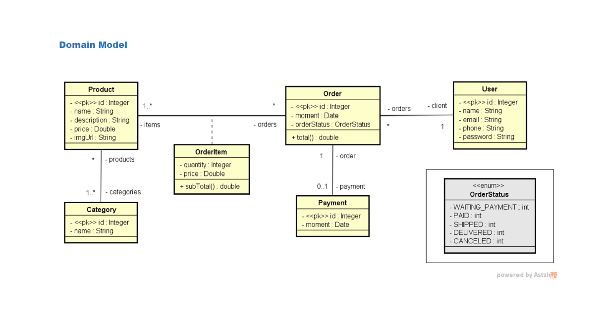
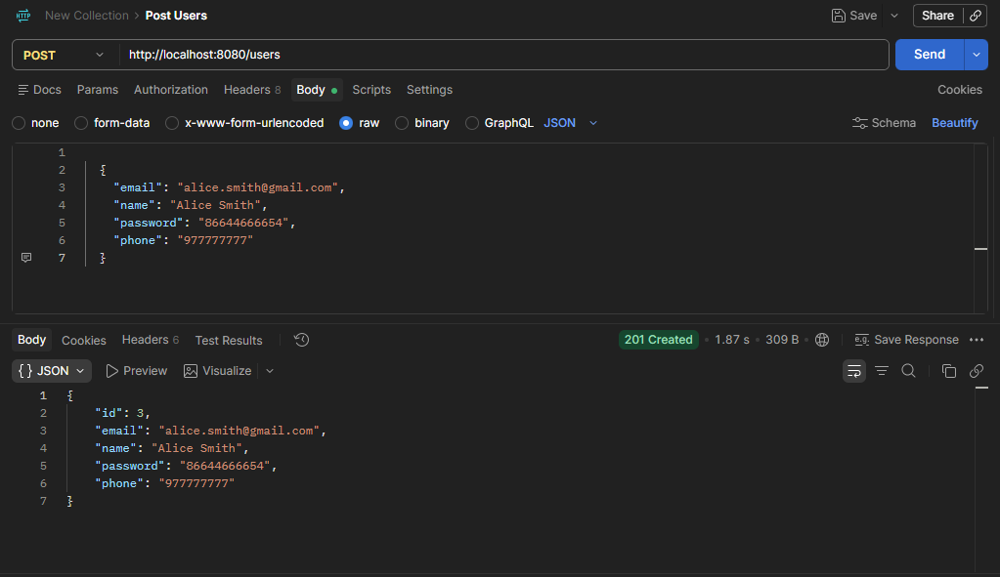
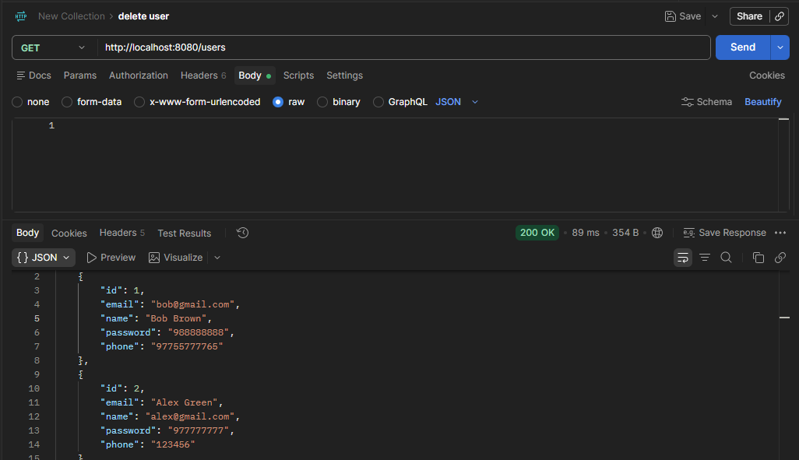
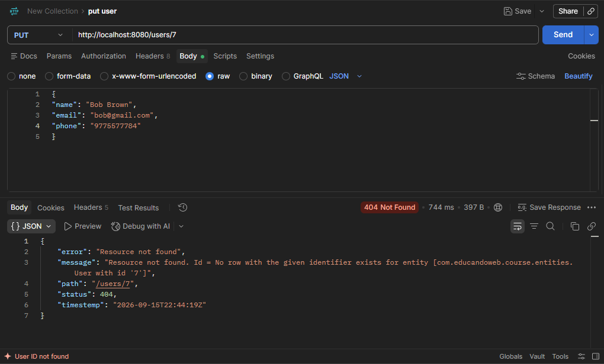
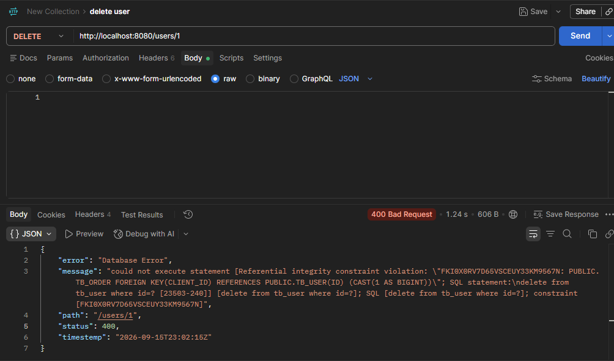

# 🛒 Web Services com Spring Boot e JPA/Hibernate | Tratamento de Exceções


## 📌 Sobre o projeto

API REST para um sistema de e-commerce (usuários, produtos, categorias, pedidos e pagamentos), com foco em **modelagem de domínio** e em um **tratamento de exceções robusto e centralizado**.

O objetivo do projeto foi ir além do CRUD básico, garantindo que a API responda sempre com status HTTP corretos e mensagens de erro claras e padronizadas — algo essencial em APIs profissionais.

## 🚀 Funcionalidades

- CRUD completo de usuários (`GET`, `POST`, `PUT`, `DELETE`)
- Modelagem de domínio completa: `User`, `Product`, `Category`, `Order`, `OrderItem`, `Payment`
- Tratamento global de exceções com `@ControllerAdvice`
- Respostas de erro padronizadas (`StandardError`) com timestamp, status, mensagem e path
- Regras de negócio na camada de serviço, isolando o controller de detalhes de persistência

## 🧩 Modelo de domínio



## 🛠️ Tecnologias utilizadas

- **Java 17**
- **Spring Boot 3** (Web, Data JPA)
- **H2 Database** (ambiente de testes em memória)
- **Maven**
- **Postman** (testes manuais dos endpoints)

## 📂 Estrutura do projeto

```
com.educandoweb.course
├── config          # Configurações de perfil (ex: TestConfig, carga inicial de dados)
├── entities        # Entidades JPA (User, Product, Category, Order, OrderItem, Payment)
│   ├── enums        # OrderStatus
│   └── pk           # Chaves compostas (OrderItemPK)
├── repositories    # Interfaces Spring Data JPA
├── resources       # Controllers REST
│   └── exceptions   # ResourceExceptionHandler, StandardError
└── services        # Regras de negócio
    └── exceptions   # ResourceNotFoundException, DataBaseExceptions
```

## ⚠️ Tratamento de exceções

Esse foi o ponto central do projeto. A API trata dois cenários principais ao manipular um usuário:

| Cenário | Status | Exceção lançada |
|---|---|---|
| Buscar/atualizar/deletar um usuário que não existe | `404 Not Found` | `ResourceNotFoundException` |
| Deletar um usuário com vínculos no banco (ex: pedidos associados) | `400 Bad Request` | `DataBaseExceptions` (violação de integridade referencial) |

Todas as exceções são capturadas de forma centralizada pelo `ResourceExceptionHandler`, evitando `try/catch` espalhado pelos controllers e garantindo uma resposta padronizada (`StandardError`) para o cliente da API:

```json
{
  "timestamp": "2026-09-15T23:02:15Z",
  "status": 400,
  "error": "Database Error",
  "message": "could not execute statement [Referential integrity constraint violation...]",
  "path": "/users/1"
}
```

### 💡 O que eu aprendi resolvendo isso

Durante o desenvolvimento, encontrei e resolvi dois bugs reais de tratamento de exceção:

1. **`@ExceptionHandler` apontando para o tipo errado** — o handler estava anotado para capturar `DataAccessException` (uma exceção genérica do Spring), mas o código lançava a exceção customizada `DataBaseExceptions`. Como uma não é subtipo da outra, o Spring não reconhecia o handler e a aplicação caía no erro padrão (`500 Internal Server Error`) em vez de retornar `400` com a mensagem certa. Corrigido apontando o `@ExceptionHandler` para a exceção realmente lançada.
2. **Mudança de comportamento do Spring Data JPA** — em versões mais recentes, `deleteById()` deixou de lançar `EmptyResultDataAccessException` quando o id não existe, então deletar um usuário inexistente retornava `204 No Content` silenciosamente. A solução foi validar a existência do recurso explicitamente com `existsById()` antes de deletar, lançando `ResourceNotFoundException` quando necessário.

Esses dois casos reforçaram a importância de testar não só o "caminho feliz", mas também os cenários de erro — e de entender exatamente o que cada exceção do framework representa antes de tratá-la.

## 🎬 Demonstração dos endpoints

**Criação de usuário — `POST /users` → 201 Created**



**Listagem de usuários — `GET /users` → 200 OK**



**Usuário inexistente — `PUT /users/{id}` → 404 Not Found**



**Usuário com vínculos — `DELETE /users/{id}` → 400 Bad Request**



## ▶️ Como executar

```bash
git clone <link-do-seu-repositorio>
cd <nome-do-projeto>
./mvnw spring-boot:run
```

A aplicação sobe em `http://localhost:8080`, com o banco H2 em memória e uma carga inicial de dados de teste.

## 👤 Autor

**Antônio Carlos Melo de Albuquerque**
Estudante de Ciência da Computação | Back-end Java

## 🔭 Possíveis próximos passos

O material do curso também aborda, como etapa opcional, a migração do banco de testes (H2) para **PostgreSQL** e o deploy da aplicação no **Heroku**. Não fiz essa etapa neste projeto, mas é um bom próximo passo para evoluir a aplicação para um ambiente mais próximo de produção.

## 📚 Créditos

Projeto inspirado no módulo *"Web Services com Spring Boot e JPA/Hibernate"*, do curso **"Java COMPLETO Programação Orientada a Objetos + Projetos"** ([Dr. Nélio Alves](https://devsuperior.com.br), Udemy).

---
*Este repositório contém minha implementação pessoal do projeto, incluindo a resolução de bugs próprios encontrados durante o desenvolvimento (ver seção de tratamento de exceções acima).*
